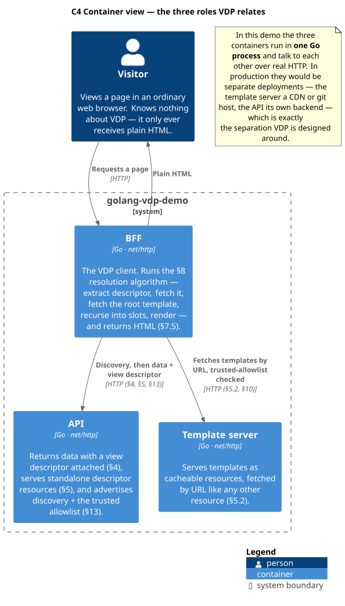
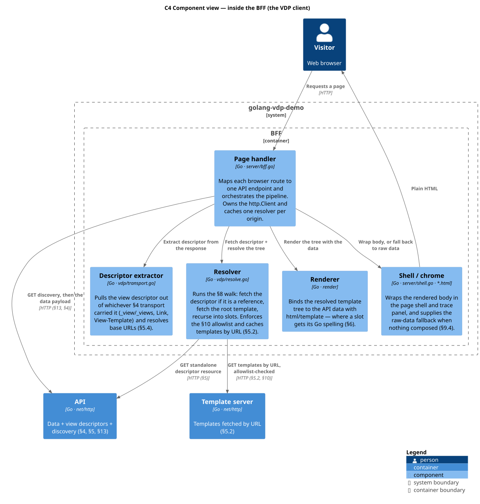
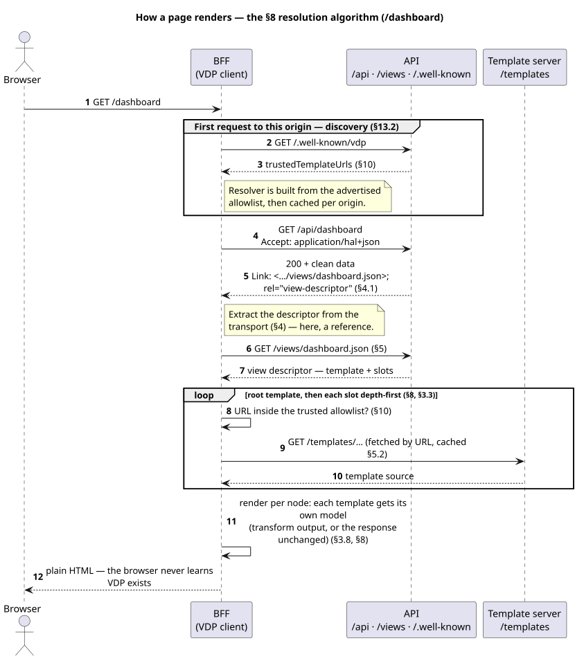
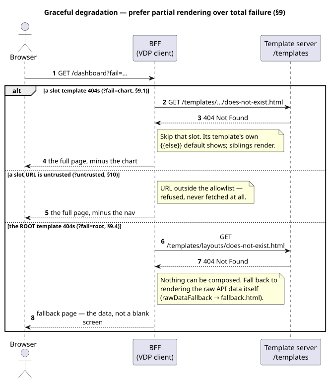

# golang-vdp-demo

A working demonstration of the [View Descriptor Protocol](https://vdprotocol.org/specification/)
(VDP) v0.2 in Go, with no dependencies outside the standard library.

With VDP, each API response carries a small **view descriptor** — a JSON block
naming which template renders the data and how sub-templates fill its slots — so
no client has to hardcode that decision. This demo implements the protocol end to
end and shows each part of the spec working on real HTTP.

```
go run .        # then open http://localhost:8080
go test ./...
```

## What it does

One process plays the three roles VDP defines a relationship between. They talk
to each other over real HTTP rather than sharing memory, so the protocol is
actually on the wire and visible to `curl`:

| Role                | Serves            | What it does                                            |
|---------------------|-------------------|---------------------------------------------------------|
| **API**             | `/api/…`          | Returns data with a view descriptor attached (§4)        |
|                     | `/views/…`        | Standalone, cacheable view descriptor resources (§5)     |
|                     | `/.well-known/vdp`| Discovery: trusted URL prefixes, prefetchable descriptors (§13)|
| **Template server** | `/templates/…`    | Serves templates, fetched by URL like any resource (§5.2) |
| **BFF**             | `/`               | Resolves the template tree, renders HTML (§7.5, §8)      |

The BFF is the VDP *client*. It runs the §8 resolution algorithm: extract the
descriptor, fetch it if it is a reference, fetch the root template, recurse into
slots, render. The browser never learns VDP exists — it receives plain HTML.

**Every page carries a trace panel** showing the transport used, the descriptor
it was rendered from, the resolved template tree, and each fetch. That panel is
the point of the demo; the dashboard data is filler.

A **Light / Dark / System** control sits in the top right. "System" is the
default and follows the OS live; an explicit choice persists in `localStorage`.
Like the trace panel, it is the shell's own chrome — VDP has no opinion on
styling (§1).

## How it works

At the highest level, the demo is the three roles from the table above, drawn as
a [C4 container diagram](https://c4model.com/#ContainerDiagram). They run in one
Go process here but talk only over HTTP, so the protocol is genuinely on the wire
— the same separation you would deploy across a backend, a CDN and a client in
production.

<picture>
  <source media="(prefers-color-scheme: dark)" srcset="docs/images/c4-container-dark.svg">
  
</picture>

Inside the BFF — the VDP client — that work is a handful of components: a page
handler that orchestrates, the `vdp` package's descriptor extractor and resolver,
the `render` binding, and the shell chrome that wraps the result (or falls back
to raw data). It maps directly onto the [code layout](#code-layout) below.

<picture>
  <source media="(prefers-color-scheme: dark)" srcset="docs/images/c4-component-bff-dark.svg">
  
</picture>

Zooming in further, rendering `/dashboard` runs the §8 algorithm end to end. Each arrow below is a
real HTTP request — discovery happens once per origin and seeds the trusted
allowlist, the descriptor arrives by `Link` header and is fetched as its own
resource, then the root template and every slot are fetched by URL and composed.
The browser only ever sees the resulting HTML.

<picture>
  <source media="(prefers-color-scheme: dark)" srcset="docs/images/render-page-dark.svg">
  
</picture>

Composition is **best-effort** (§9): a broken slot is skipped so the rest of the
page still renders, an untrusted template URL is refused outright, and only when
the *root* template cannot be fetched does the client fall back to showing the
raw API data instead of a blank page.

<picture>
  <source media="(prefers-color-scheme: dark)" srcset="docs/images/graceful-degradation-dark.svg">
  
</picture>

> Diagrams are generated from the PlantUML sources in [`docs/diagrams/`](docs/diagrams).
> Each diagram is a shared body (`_name.iuml`) with light and dark wrappers
> (`name.puml`, `name-dark.puml`); the `<picture>` elements above serve the dark
> variant to readers in GitHub's dark theme. To regenerate after editing (the
> glob renders every wrapper but not the `_*.iuml` includes; PlantUML resolves
> `-o` relative to each source file, so `../images` lands them in `docs/images/`):
> ```bash
> /usr/bin/java -jar ~/.local/plantuml/plantuml.jar -tsvg -o ../images docs/diagrams/*.puml
> ```

## The demos

| Page            | Shows                                            | Spec                       |
|-----------------|--------------------------------------------------|----------------------------|
| `/dashboard`    | A template tree four levels deep, via `Link` header, with path-absolute template URIs resolved against the descriptor's URL; the nav arrives by descriptor reference and the chart legend is integrity-verified | §3.3, §3.6, §3.7, §4.1, §5, §5.4, §7.2 |
| `/login`        | One template, no composition, `View-Template` shorthand | §3.1, §4.1, §7.1     |
| `/product/42`   | Two views of one payload — add `?view=compact`    | §3.4, §4.2, §7.4           |
| `/feed`         | One slot filled by three templates, in order     | §3.5                       |
| `/odata`        | A rigid OData4 body the descriptor never touches; its template is named by a scheme-less opaque identifier, kept verbatim as the cache key | §4.3, §5.4, §6.3, §7.3     |

### Failure modes (§9)

VDP composition is best-effort: **prefer partial rendering over total failure**.

| Link                        | What happens                                                              |
|-----------------------------|---------------------------------------------------------------------------|
| `/dashboard?fail=chart`     | A slot's template 404s → slot skipped, its template's default content shows, rest of the page renders (§9.1) |
| `/dashboard?untrusted=1`    | The referenced nav descriptor names a template outside the trusted allowlist → never fetched (§10) |
| `/dashboard?fail=integrity` | The legend's published SRI digest cannot match its bytes → treated as a fetch failure, slot skipped (§3.6, §9.1) |
| `/dashboard?fail=root`      | The *root* template 404s → nothing to compose, so fall back to raw data (§9.4) |

## Look at the wire

```bash
# The descriptor rides on a Link header; the body stays clean (§4.1)
curl -i localhost:8080/api/dashboard

# The descriptor resource it points to (§5)
curl -i localhost:8080/views/dashboard.json

# The nav descriptor it references from a slot (§3.7)
curl -i localhost:8080/views/nav.json

# Inline _views, offering two views of one payload (§4.2)
curl -s localhost:8080/api/products/42

# Discovery (§13.2, served as application/vdp-discovery+json) and OPTIONS
# advertisement (§13.1)
curl -s localhost:8080/.well-known/vdp
curl -i -X OPTIONS localhost:8080/api/dashboard
```

## Code layout

```
vdp/          The protocol. Reusable, and free of template-engine knowledge.
  descriptor.go  §3 format: ViewDescriptor, slots, references, multi-view
  transport.go   §4 transports: _view/_views, Link, View-Template, precedence
  resolve.go     §8 resolution, §9 error handling, §10 allowlist, §5.4 base URLs
  integrity.go   §3.6 template integrity verification (W3C SRI)
  discovery.go   §13 discovery document, endpoint matching, media type
render/       The html/template binding — where slots get a Go spelling.
server/       The demo: api.go, templates.go, bff.go, and the shell chrome.
templates/    The templates themselves, served over HTTP.
static/       Stylesheet and the theme control. Chrome, not protocol.
```

### Slots in Go

VDP asks one thing of a template language: **named insertion points that can be
filled externally** (§6). The spec's §6.1 table maps that onto Qute, HTML
`<slot>`, Thymeleaf, SwiftUI and others. It has no Go row, so this demo adds the
natural one — a template function:

```html
<main>{{slot "mainContent"}}</main>
```

An unfilled slot renders as empty, which is what lets a template supply its own
default content for a slot that was never filled, or one whose template failed
to resolve (§9.1):

```html
{{with slot "revenueChart"}}{{.}}{{else}}<p>Chart unavailable</p>{{end}}
```

Everything about that spelling is the engine's business, not the protocol's.
The descriptor only ever names *templates* and *slots* — which is why the same
descriptor could drive a Compose or SwiftUI client unchanged.

### What VDP deliberately does not do

Worth knowing before reading the templates, because their absence is a design
decision rather than an omission (spec Design Decisions 1–3):

- **Declarative reshaping only (0.2).** A descriptor node's `transform` maps
  the response onto the template's fixed model with RFC 6901 pointers — no
  logic, no filtering, no computation. Anything past reshaping belongs to the
  server, the template, or client-registered `$mapper` code (the `/summary`
  demo). Every node's transform reads the *original* response, never a
  parent's output (§3.8.2).
- **No template parameters.** No `{"compact": true}` reaches a template — and
  no `$const` exists in the transform grammar for the same reason.
- **No conditional slots.** The server sends a *different descriptor* for an
  admin than for a guest. VDP describes what to render, not when or for whom.

## Notes on this implementation

- **Templates are fetched over HTTP, never read from the embedded FS.** They are
  embedded only so the binary is self-contained; the resolver goes over the wire
  like any client would, and caches by URL (§5.2).
- **The trusted allowlist comes from `/.well-known/vdp`**, not from a constant —
  §13.2 feeding §10, via the spec's source chain: local configuration first,
  then the discovery document, and with neither only same-origin templates are
  trusted.
- **Slot resolution order is sorted.** VDP fixes order *within* an array slot
  (§3.5) but says nothing about slots themselves, and Go's random map iteration
  would otherwise make traces differ every run.
- **HTTPS is not used.** §10 requires HTTPS for any template retrieved over a
  network; this demo runs on `http://localhost`, the loopback exception the
  spec permits for local development — and the resolver enforces exactly that:
  HTTPS always passes, plain HTTP only for loopback hosts. A real deployment
  must not relax it.
- **Sub-template output is spliced in as trusted markup**, while data rendered by
  a template is escaped normally. That split is only sound because of the
  allowlist — hence §10's insistence on it.

## License

Released under the MIT License, matching the [View Descriptor Protocol](https://vdprotocol.org/specification/)
spec it demonstrates. See [LICENSE](./LICENSE).
